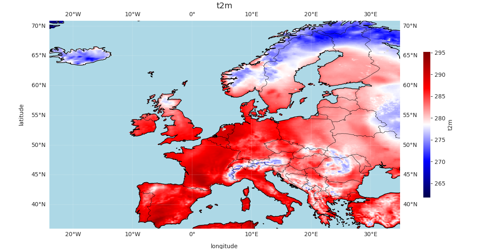
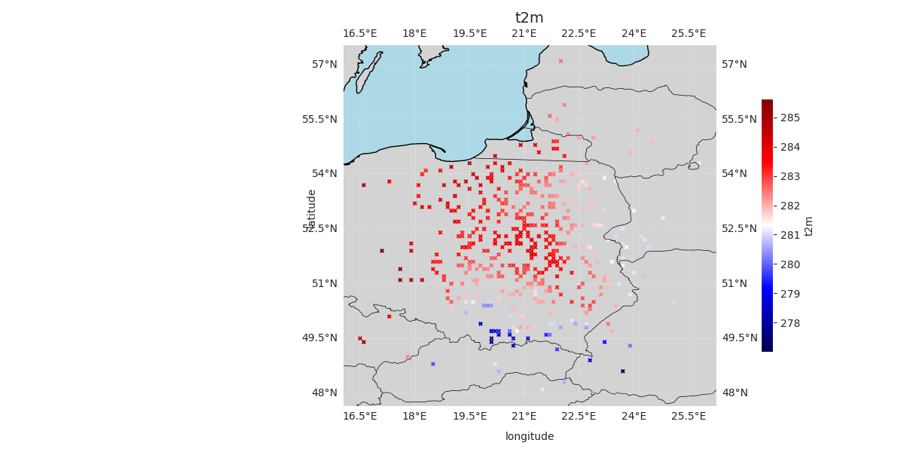
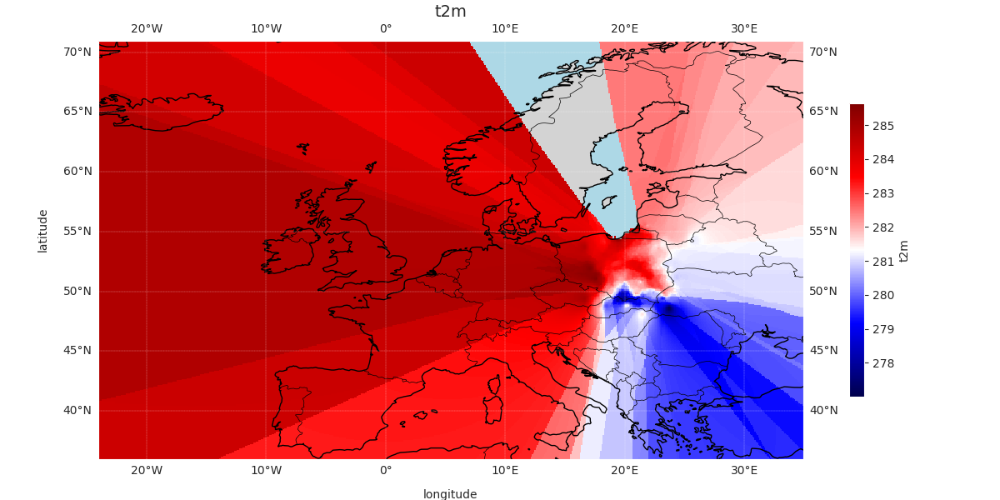
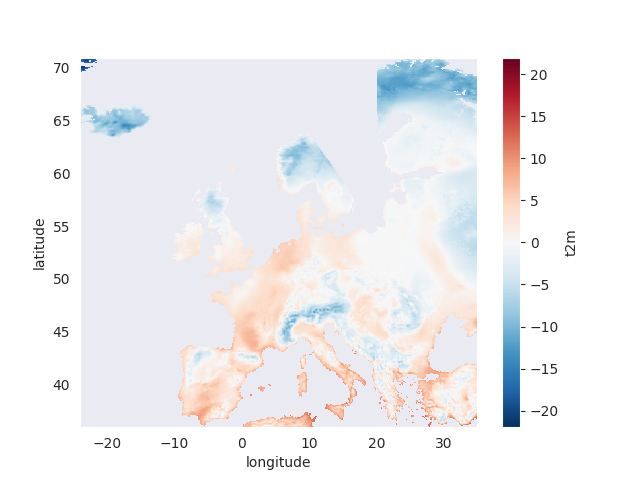
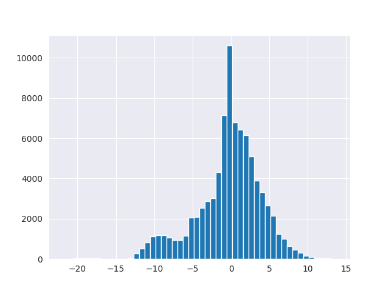

# 👋 Welcome to the `climatrix` Tutorial

This tutorial will walk you through some typical use cases showing how `climatrix` makes managing climate data easier.

We'll simulate sparse meteorological observations spread across Europe.

---

## 🛠️ Step A: Configure Access to CDS

???+ warning
    If you already have a `~/.cdsapirc` file, you can skip this step.

To configure access to the CDS (Climate Data Store), run:

```bash
cm dataset config cds
```

To configure CDS store.

## 📥 Step B: Download ERA5-Land Reanalysis Data
We'll use the ERA5-Land global reanalysis product. To download it, run:

```bash
cm dataset download era5-land --year 2018 --month 10 --day 12 --target ./era5-land.nc
```

???+ note 
    Downloading data can take a few minutes—please be patient.


## 📂 Step C: Open the Dataset
We’ll open the dataset using the `climatrix` accessor:

``` { .python .annotate }
import xarray as xr
import climatrix as cm # (1)!

dset = xr.open_dataset("./era5-land.nc").cm
```

1.  Even though we're not using climatrix directly, we must import it to enable the `climatrix` xarray accessor to available.


## 🌍 Step D: Shift to Signed Longitude Convention

ERA5-Land uses the positive longitude convention  ($\lambda \in [0, 360]$). To make it easier to work with Europe, we’ll convert it to the signed convention ($\lambda \in [-180, 180]$).

``` { .python .annotate }
dset = dset.to_signed_longitude()
```

???+ warning
    Changing longitude convention on a large dataset can be time and memory intensive.

## 🌐 Step E: Subset to Europe

We'll now extract a region covering Europe:

``` { .python .annotate }
europe = dset.subset(north=71, south=36, west=-24, east=35)
```

## ⏱️ Step F: Select a Single Time Instant

???+ note
    `cliamtrix` currently doesn’t support plotting dynamic datasets. Let’s select a single timestamp.

To select a single time instant, let's use:

``` { .python .annotate }
europe = europe.time("2018-10-12T04:00:00")
europe.plot()
```
{ align=left }

???+ tip
    You can also pass Python [`datetime`](https://docs.python.org/3/library/datetime.html) object to the [`time`](https://jameswalczak.github.io/climatrix/latest/api/#climatrix.dataset.base.BaseClimatrixDataset.time) method.


## 🎯 Step G: Sample Data Around Warsaw
We'll create a sparse sample of data points around Warsaw, using a normal distribution:

``` { .python .annotate }
WARSAW = (21.017532, 52.237049)
sparse = europe.sample_normal(number=5_00, center_point=WARSAW, sigma=1.5)
```

???+ tip
    You can use the `portion` argument instead of `number` to sample a fraction of the dataset (e.g., 50%).

## 🖼️ Step H: Plot the Sparse Observations

Now we can plot the output:

``` { .python .annotate }
sparse.plot()
```

{ align=left }

???+ warning
    Plotting requires downloading coastline and border data, so it may take longer the first time.

## 🏗️ Step H.1: Creating Custom Domains (Optional)

You can create custom domains with multiple axis types using the builder pattern. This is especially useful when working with vertical levels or custom time series:

``` { .python .annotate }
from climatrix.dataset.domain import Domain

# Create a domain with vertical levels around Warsaw
custom_domain = (Domain.from_axes()
                 .vertical(pressure=[1000, 850, 700, 500])  # (1)!
                 .lat(latitude=[51.5, 52.0, 52.5])
                 .lon(longitude=[20.5, 21.0, 21.5]) 
                 .time(time=['2018-10-12T00:00', '2018-10-12T06:00'])
                 .sparse())  # (2)!

print(f"Custom domain size: {custom_domain.size}")
print(f"Has vertical axis: {custom_domain.has_axis('vertical')}")
```

1. Define pressure levels as the vertical coordinate
2. Create as sparse domain - vertical and time are independent dimensions

???+ note "Domain Builder Features"
    The `from_axes()` builder supports:
    
    - **Vertical axes**: `pressure`, `depth`, `level`, etc.
    - **Time axes**: Various time coordinate names
    - **Custom names**: Any parameter name for each axis type
    - **Flexible inputs**: Slices, lists, or numpy arrays


## 🔁 Step I: Reconstruct Using IDW
We’ll reconstruct a dense field from the sparse data using Inverse Distance Weighting (IDW):


``` { .python .annotate }
idw = sparse.reconstruct(europe.domain, method="idw") # (1)!
idw.plot()
```

1. We want to reconstruct data for all Europe (`europe.domain`).

{ align=left }

???+ note
    Note that we reconstructed the data for the entire Europe. Those visible artifacts are the result of too few samples concentrated around Warsaw. They are not representative for the entire Europe. 


## 📊 Step J: Compare with Original Data
We'll use [`Comparison`](https://jameswalczak.github.io/climatrix/latest/api/#climatrix.comparison.Comparison) object to visualize the differences.

``` { .python .annotate }
import matplotlib.pyplot as plt # (1)!

cmp = cm.Comparison(europe, idw) 
cmp.plot_diff()
cmp.plot_signed_diff_hist()

plt.show()
```

1. We explicitly import `matplotlib` to be able to run `plt.show()` and display figures. 




## 🎯 Step K: Optimize Hyperparameters

To improve reconstruction quality, let's optimize the IDW hyperparameters. We'll split our sparse data for training and validation:

``` { .python .annotate }
from climatrix.optim import HParamFinder

# Create training and validation datasets
train_sparse = europe.sample_normal(number=300, center_point=WARSAW, sigma=1.5) # (1)!
val_sparse = europe.sample_normal(number=200, center_point=WARSAW, sigma=1.5)   # (2)!

# Find optimal hyperparameters
finder = HParamFinder(train_sparse, val_sparse, method="idw", n_iters=20) # (3)!
result = finder.optimize()

print(f"Best parameters: {result['best_params']}")
print(f"Best MAE score: {result['best_score']}")
```

1. Training data - used to fit the hyperparameter optimization
2. Validation data - used to evaluate parameter combinations  
3. Using fewer iterations for this tutorial example

## 🚀 Step L: Apply Optimized Parameters

Now let's reconstruct using the optimized parameters:

``` { .python .annotate }
# Reconstruct with optimized parameters
optimized_idw = sparse.reconstruct(
    europe.domain, 
    method="idw", 
    **result['best_params'] # (1)!
)

# Compare optimized vs default reconstruction
optimized_cmp = cm.Comparison(europe, optimized_idw)
default_cmp = cm.Comparison(europe, idw)

print(f"Default IDW RMSE: {default_cmp.compute_rmse():.4f}")
print(f"Optimized IDW RMSE: {optimized_cmp.compute_rmse():.4f}")

optimized_idw.plot(title="Optimized IDW Reconstruction")
```

1. Apply the best parameters found by the optimizer

???+ note
    For hyperparameter optimization, make sure to install climatrix with: `pip install climatrix[optim]`

## 🌍 Step M: Interactive plotting

You can interactively plot the resulting dataset. Just run

```python
cm.plot.Plot(dataset=cm_ds).show(port=5000)
```

That will run locally the server and enables you to conveniently explore the dataset via web browser.

???+ tip
    If the preview does not open, choose your faviourite web browser and open `[http://localhost:5000/](http://localhost:5000/)` if you selected port `5000`.
